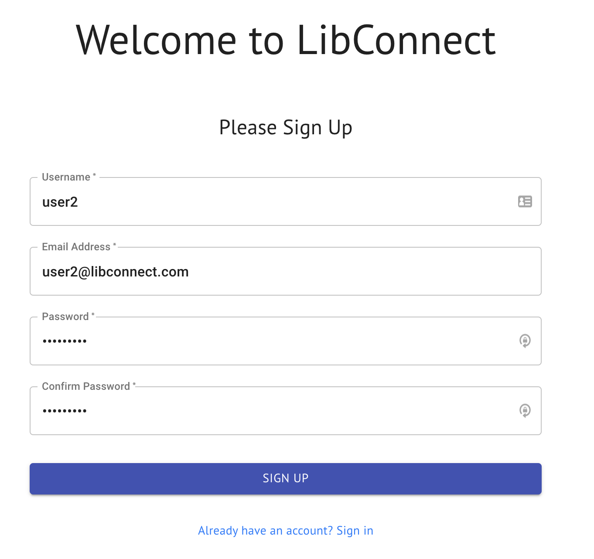
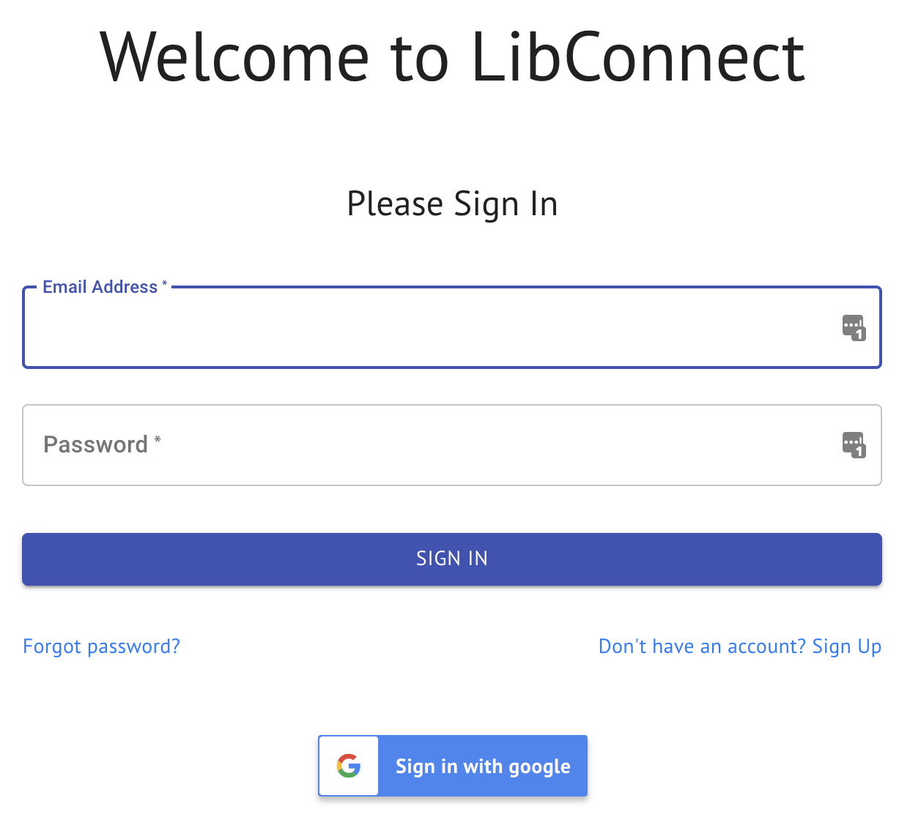
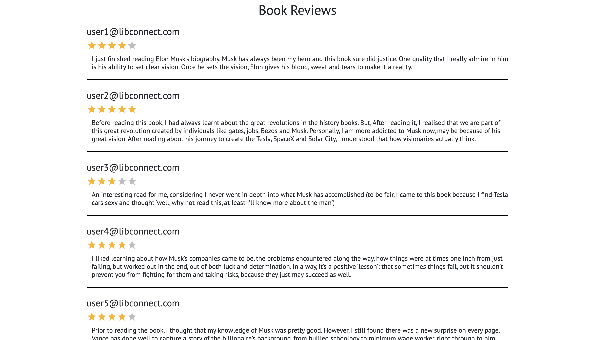
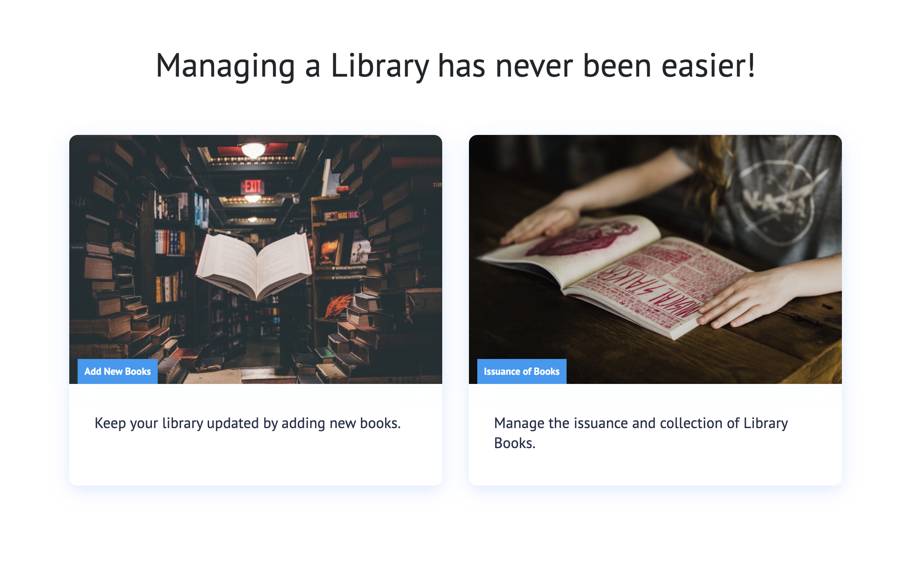
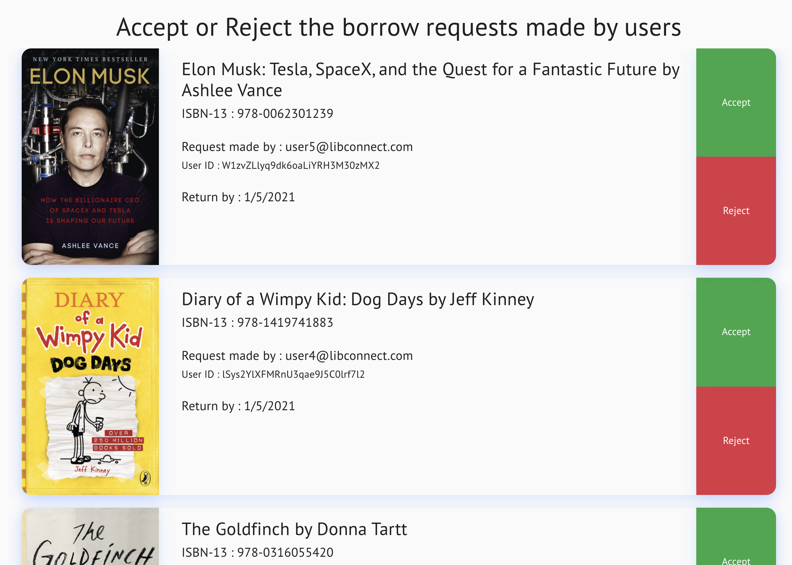
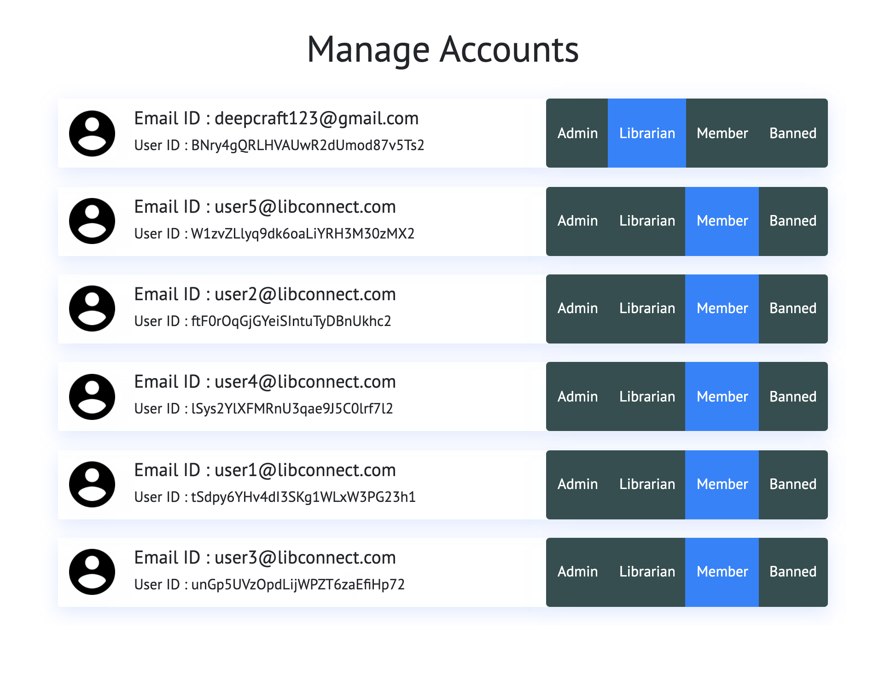
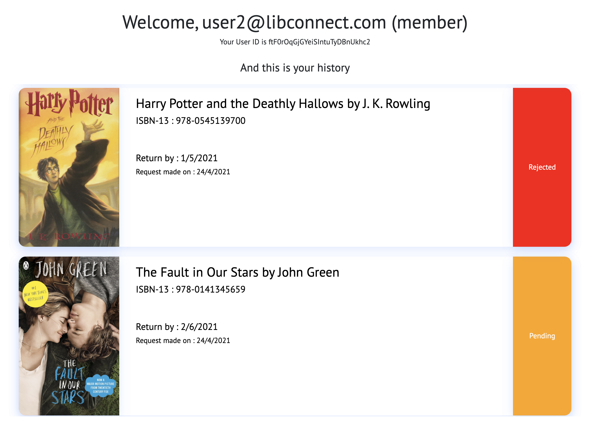

# LibConnect

LibConnect is a react web application which facilitates easy library management incuding the issuance of books.
# IMPORTANT
I tried hosting the site but it was extremely buggy. So, I would really appreciate it if you ran it locally.</br>
1. Firstly, either download my repo or clone it into your device.
2. Then, in the terminal, change directory to the libconnect folder. ```cd libconnect\``` Please make sure this is the **libconnect** folder which is in the same level as the **screenshots** folder.
3. Now, run the command ```npm i```. This should generate the **node_modules** folder (Might take a minute).
4. Finally, enter the command ```npm start```. This should start hosting the website locally in your default browser. :)

As ```firebase``` doesn't let users sign in with username, my website uses sign in with email and password ( and sign in with google).  Also, ```firebase``` doesn't let users set a password with less than 6 characters. So, I did not follow the user log in info mentioned in the recruitment pdf.

There are 6 accounts already registered: 
```
email: admin@libconnect.com
password: admin123
```
```
email: user1@libconnect.com
password: password1
```
```
email: user2@libconnect.com
password: password2
```
```
email: user3@libconnect.com
password: password3
```
```
email: user4@libconnect.com
password: password4
```
```
email: user5@libconnect.com
password: password5
```
```admin@libconnect.com``` is an admin. All other users are initially set as members.


# Table of Contents  
 - [Sign In / Sign Up](#sign-in--sign-up)  
 - [Access to features based on role](#access-to-features-based-on-role)
 - [Home Page](#home-page)
 - [Book Info Page](#book-info-page)  
 - [Librarian Tab](#librarian-tab)
 - [Admin Tab](#admin-tab)
 - [Account Tab](#account-tab)

<br/>
<a name="sign-in--sign-up"/>

## Sign In / Sign Up
When a user makes a new account, by default the role set as a ```member```. The user can also choose to sign in with his **Google** account

<br/>

 
<br/>
<a name="access-to-features-based-on-role"/>

## Access to features based on role

* A non-member or a banned-member can only see the **Home** tab in the navigation bar.
 <br/>
* A ```member``` can see the **Home** tab along with his/her **Account** tab.
 <br/>
* A ```librarian``` can see the **Home** tab, **Librarian** tab & the **Account** tab.
 <br/>
* An ```admin``` can see the **Home** tab, **Admin** tab, **Librarian** tab & the **Account** tab.
 
<br/>
<a name="home-page"/>

## Home Page
The home page includes the **Search Bar**, **Genre Filter** & the thumbnails of all books along with the title and author. The **Search Bar** & **Genre Filter** can be used together to search for a book ina particular genre.
<br/><br/>
 
 

<a name="book-info-page"/>

## Book Info Page
When the user clicks on a book in the **Home Page**, he/she will be taken to that book's info page. In this page, the user can view the book’s details like title, author, publisher, genre, summary, ISBN, location, availability, rating, etc. The user can also publish a book review and rating and can also view other users' reviews and ratings. In this page, the user can also request to borrow a book, can view his/her request status, return date, etc.
* **Only members are allowed to request to borrow a book**.
* **Only admins and librarians can edit ad delete the book**.
* **Each user can only publish one review**.
* **Only admins are allowed to delete book reviews**.
<br/><br/>



<br/>
<a name="librarian-tab"/>

## Librarian Tab
The Librarian tab allows ```librarians``` and ```admins``` to add new books to the library and also accept and reject borrow requests made by members.
<br/><br/>



<a name="admin-tab"/>

## Admin Tab
The Admin tab allows  ```admins``` to manage accounts and change the roles of other users. The ```admins``` an also ban/unban other users.
<br/><br/>

<a name="account-tab"/>

## Account Tab
The Account tab tab shows all the account info including **Email**, **Role**, **User ID** & **User History**. The **User History** shows all requests made by the user along with the request status in chronological order.
<br/><br/>

